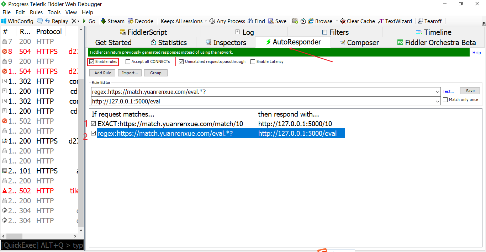
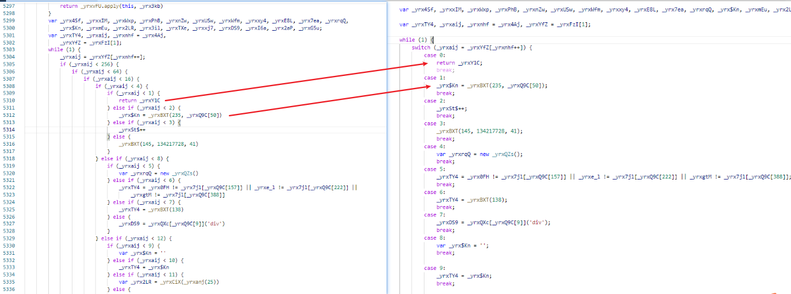
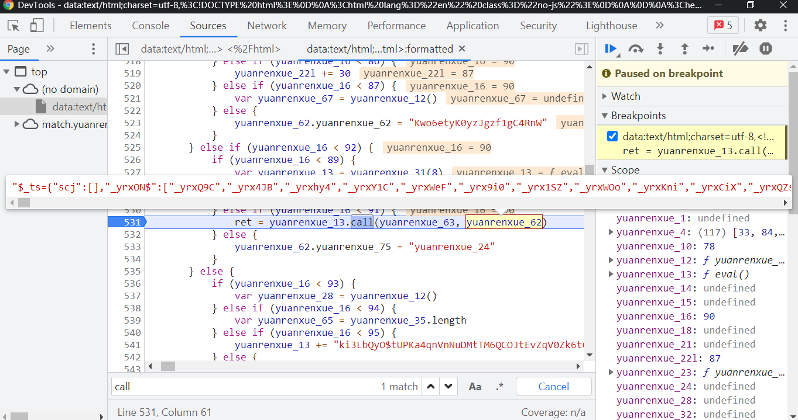
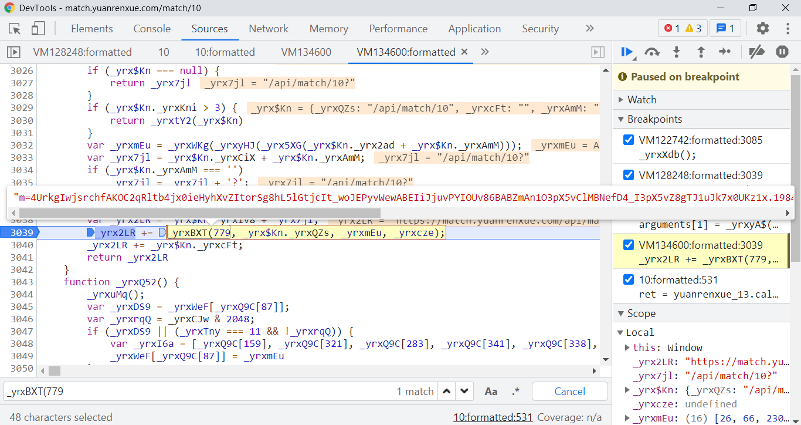
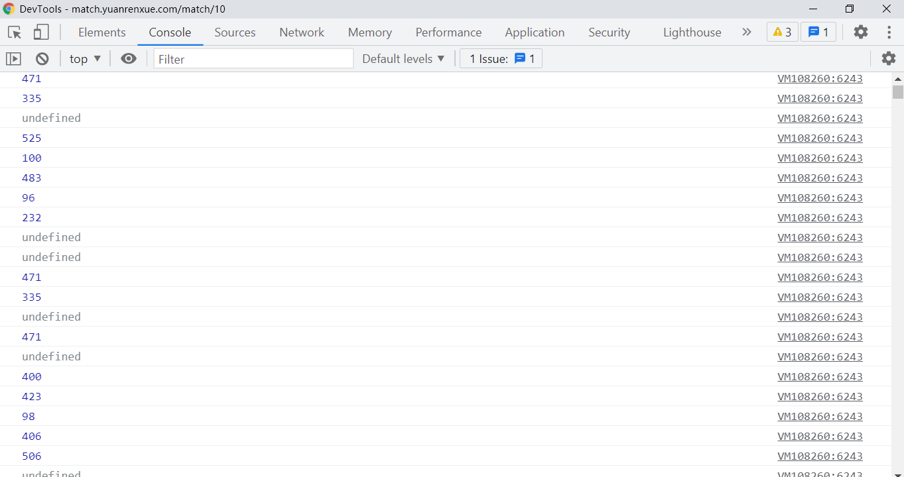
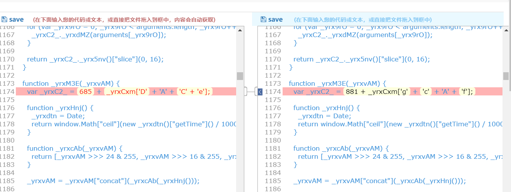

# 猿人学爬虫攻防赛 第10题
题目地址
```
https://match.yuanrenxue.com/match/10
```
总的评价：4代R数的低配静态版的壳 + jsjiami.com.v6 + obfuscator  
最近学习了AST拿这个题试一下水，从编写`提高代码可读性的插件`、`搭建本地调试环境`、`扣代码`花了整整3天，最后成功的一刻，喜悦满溢。
## 调试工具和本地调式环境的搭建

**确保安装以下软件或环境**  
- fiddler 使用AutoResponser 替换响应 用于搭建调试环境
- python 和 nodejs 环境和相关依赖，如python的flask nodejs的express等
- chrome 开发者工具

1. 启动调试代码中`app.py`
2. 在fiddler AutoResponer中添加两条规则（如图所示）
   - `EXACT:https://match.yuanrenxue.com/match/10` -> `http://127.0.0.1:5000/10`
   - `regex:https://match.yuanrenxue.com/eval.*?` -> `http://127.0.0.1:5000/eval`
    
经过这样配置重新打开[猿人学第十题的首页](https://match.yuanrenxue.com/match/10)仍可以加载数据,按F12打开chrome开发者工具不会进入无限debugger说明调试环境已经搭建成功。

简单讲一下几处使用AST提高代码可读性的地方  
1. 把$_ts["dfe1683"]的字符串解密为eval执行的字符串
```
let yuanrenxue_36='';var yuanrenxue_59=968;var i锝塴='jsjiami.com.v6',yuanrenxue_150=[i锝塴, .... 此处省略几百行代码
```
还原后的结果  
```
let yuanrenxue_36 = '';
var yuanrenxue_59 = 968;
for (let yuanrenxue_229 = 0; yuanrenxue_229 < $_ts["dfe1683"]["length"]; yuanrenxue_229++) {
yuanrenxue_36 += String["fromCharCode"]($_ts["dfe1683"][yuanrenxue_229]["charCodeAt"]() - yuanrenxue_229 % yuanrenxue_59 - 50);
    }
yuanrenxue_18 = atob(yuanrenxue_36);
yuanrenxue_31(78, yuanrenxue_18);
```
2. 把首页请求数据的代码还原，用obfuscator混淆的，其他还有几段，ob混淆的都不重要但无限debugger很烦，还原之后就清爽多了。请求在这里但请求的参数m并不是在这里生成的，具体后面再讲。
```
window["url"] = "/api/match/10";

request = function () {
  const _0x434855 = {
    "page": window["page"]
  };
  $["ajax"]({
    "url": window["url"],
    "dataType": "json",
    "async": false,
    "data": _0x434855,
    "type": "GET",
    "beforeSend": function (_0x291a2d) {},
    "success": function (_0x1f076c) {
      if (window["page"]) {} else window["page"] = 1;

      window[_0x1f076c["k"]["k"]["split"]("|")[0]] = parseInt(_0x1f076c["k"]["k"]["split"]("|")[1]);
      _0x1f076c = _0x1f076c["data"];
      let _0x110e6b = '';
      // let _0x14dced = [省略一些不重要的数据，总的来说这段都不重要]
      });
      $("#feedContent0")["text"]('')["append"](_0x110e6b);
    },
    "complete": function () {},
    "error": function (_0x402e16, _0x4f092f, _0x1c5dfd) {
      $(".page-message")["eq"](0)["addClass"]("active");
      $(".page-message")["removeClass"]("active");
    }
  });
};

request();

```

3. eval中控制流平坦化代码的**ifelse转switch**，减少单步调试时跳的次数
  效果：
  

  babel操作代码AST的代码：  
  ```
  // 省略引包操作
  const ast = parser.parse(jscode);


function step1(ast) {
  traverse(ast, {
    IfStatement: replaceifstate2block
  })
  traverse(ast, {
    ExpressionStatement: addblockwrap
  })
  function replaceifstate2block(path) {
    // 对alternate是IfStatement套一个blockStatement
    let alternate_path = path.get('alternate');
    let node = alternate_path.node;
    if (!t.isIfStatement(node)) return;
    alternate_path.replaceWith(t.blockStatement([node]))
  }
  function addblockwrap(path) {
    let node = path.node;
    let parentNode = path.parent;
    // 当前节点的父节点也是IfStatement的情况
    if (t.isIfStatement(parentNode)) {
      path.replaceWith(t.blockStatement([node]));
    }
  }
}
// 将if...else if...else语句转为if...else语句  给没有括号的if...else语句加上括号
step1(ast);

function replaceWhile(path) {
  // 反控制流平坦化    
  var node = path.node;
  // 判断是否是目标节点   
  if (!(t.isBooleanLiteral(node.test) || t.isUnaryExpression(node.test) || t.isLiteral(node.test)))
    // 如果while中不为true或!![]
    return;
  if (!(node.test.prefix || node.test.value))
    // 如果while中的值不为true
    return;
  var body = node.body.body;
  // var body = node.body;
  // console.log(t.isBlockStatement(body))
  if (!t.isIfStatement(body[1]))
    return;
  var ifstat = body[1];
  var caseList = [];
  solveIfStat(ifstat)

  function solveIfStat(ifstat) {
    if (t.isBinaryExpression(ifstat.test)){
      var consequentstat = ifstat.consequent;
      var alternatestat = ifstat.alternate;
      solveConsequentStat(consequentstat);
      solveAlternateStat(alternatestat);
    }else{
      //其他非控制流的if表达式
      caseList.push(ifstat)
    }
    
  }
  function solveConsequentStat(consequentstat) {
    if (!t.isBlockStatement(consequentstat)) return
    if (t.isIfStatement(consequentstat.body[0])) {
      solveIfStat(consequentstat.body[0])
    } else {
      // 对于consequentstat.body 只有一个元素的把外面的括号拆了
      if (consequentstat.body.length == 1){
        caseList.push(consequentstat.body[0]);
      }else{
        caseList.push(consequentstat);
      }
    }
  }
  function solveAlternateStat(alternatestat) {
    if (!t.isBlockStatement(alternatestat)) return
    if (t.isIfStatement(alternatestat.body[0])) {
      solveIfStat(alternatestat.body[0])
    } else {
      if (alternatestat.body.length == 1){
        caseList.push(alternatestat.body[0]);
      }else{
        caseList.push(alternatestat);
      }
    }
  }
  // console.log(caseList)
  console.log(caseList.length)
  // 自增表达式
	let discriminNode = body[0].expression;
  for (let index = 0; index < caseList.length; index++) {
    let testNode = t.valueToNode(index);
    let consequent = [caseList[index], t.breakStatement()];
    let SwitchCaseNode = t.SwitchCase(testNode, consequent);
    caseList[index] = SwitchCaseNode;
  }
  let switchNode = t.SwitchStatement(discriminNode, caseList);
  path.get('body.body')[1].replaceWith(switchNode)
  path.get('body.body')[0].remove()
}
traverse(ast, { WhileStatement: { exit: [replaceWhile] }, })


var code = generator(ast)['code']
  ```
由于控制流平坦化代码中有对自增变量进行加减操作，以及最大的控制流中属于是**多个函数合并的大型控制流代码**，存在多个入口和出口，我还还原不了**请大佬指点**

## 入口寻找
### eval入口
它套了一个4代R数的壳，易得入口是下图，首页搜`call`即可

### eval中m参数加密的入口
上面这个特别长的eval执行完了什么也没返回还是不知道m参数加密的的入口，细心一点可以发现这时候发的ajax请求会自己加上m参数  
控制台输出以下xhr的`open`方法，发现果然被重写了，还是熟悉的配方  


进入这个函数打上断点，翻页重新请求一下进入这个函数就看到入口了

即
```
function _yrxyA$(_yrx7jl, _yrxcze) {
    try {
      if (typeof _yrx7jl !== _yrxQ9C[6]) {
        _yrx7jl += '';
      }
    } catch (_yrxrqQ) {
      return _yrx7jl;
    }

    if (!(_yrxCJw & 1024)) {
      _yrx7jl = _yrxR2F(_yrx7jl);
    }

    var _yrx$Kn = _yrxtSa(_yrx7jl);

    if (_yrx$Kn === null) {
      return _yrx7jl;
    }

    if (_yrx$Kn._yrxKni > 3) {
      return _yrxtY2(_yrx$Kn);
    }

    var _yrxmEu = _yrxWKg(_yrxyHJ(_yrx5XG(_yrx$Kn._yrx2ad + _yrx$Kn._yrxAmM)));

    var _yrx7jl = _yrx$Kn._yrxCiX + _yrx$Kn._yrxAmM;

    if (_yrx$Kn._yrxAmM === '') {
      _yrx7jl = _yrx7jl + '?';
    } else {
      _yrx7jl = _yrx7jl + '&';
    }

    var _yrx2LR = _yrx$Kn._yrxiv8 + _yrx7jl;
    // 入口，在eval中搜(779 可以直达
    _yrx2LR += _yrxBXT(779, _yrx$Kn._yrxQZs, _yrxmEu, _yrxcze);
    _yrx2LR += _yrx$Kn._yrxcFt;
    return _yrx2LR;
  }
```


## 扣代码
接下去就是痛苦的扣代码环节了，比较浏览器的结果和nodejs环境的结果最终使得nodejs可以得到与浏览器中相同的结果就可以了。  
一个小技巧就是打印了依次执行的case的数字，nodejs与浏览器比较以**免误入歧途**  


部分浏览器环境监测的代码处理    
- 如检测创建页面元素的  
```
function _yrxWxt() {
    var _yrxrqQ = 3
    // var _yrxrqQ = 3
    //     , _yrx$Kn = _yrxQXc[_yrxQ9C[9]]('div')
    //     , _yrxmEu = _yrx$Kn[_yrxQ9C[51]]('i');

    // while (_yrx$Kn[_yrxQ9C[38]] = _yrxQ9C[478] + ++_yrxrqQ + _yrxQ9C[118],
    //     _yrxmEu[0])
    //     ;

    // if (_yrxrqQ > 4)
    //     return _yrxrqQ;

    // if (_yrxWeF[_yrxQ9C[87]]) {
    //     return 10;
    // }
    // 在控制流中有setcookie
    // if (_yrxBXT(135, _yrxWeF, _yrxQ9C[315]) || _yrxQ9C[87] in _yrxWeF) {
    //     return 11;
    // }
}
```

- 检测userAgent
```
case 156:
    // _yrxTY4 = !(_yrxCJw & 64) || _yrxWeF[_yrxhy4(_yrxQ9C[7])].userAgent[_yrxQ9C[73]](_yrxQ9C[531]) !== -1 || _yrxWeF[_yrxhy4(_yrxQ9C[7])].userAgent[_yrxQ9C[73]](_yrxQ9C[65]) !== -1;
    _yrxTY4 = false;
    break;
```

- 检测HeadlessChrome
```
case 454:
    // _yrxTY4 = /HeadlessChrome/[_yrxQ9C[125]](_yrxrqQ[_yrxQ9C[48]]) || _yrxrqQ[_yrxQ9C[275]] === '';
    _yrxTY4 = false;
    break;
```
还有很多就不列举了。 

## 最终代码
```
https://github.com/skygongque/match-yuanrenxue/tree/master/match10
```
1. 先使用`npm instal express`安装依赖，`node server.js`启动服务
2. `python main.py`玩耍

## 其他重要的点
- eval中变量的发现，可以通过比较两份eval字符串发现



## 参考文章
爬虫术与道公众号 四代R数的文章 https://mp.weixin.qq.com/s/r3FXjvT5Mm9Ikg_bDEadcw  
蔡老板星球和公众号AST相关 https://wx.zsxq.com/dweb2/index/group/48415254524248   
某大佬AST基础概念和相关操作的整理 https://evilrecluse.top/post/7389a59f/  

