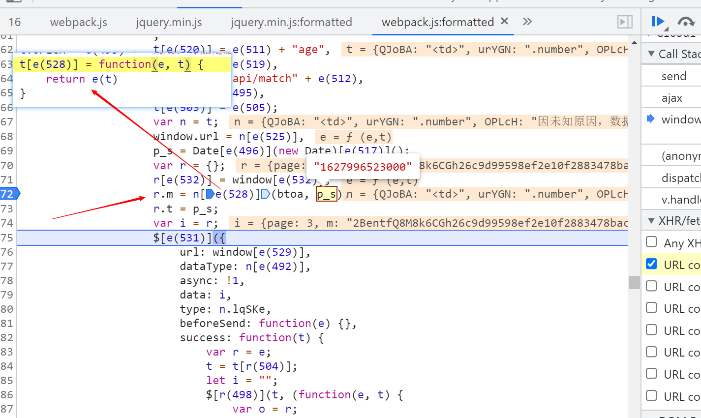
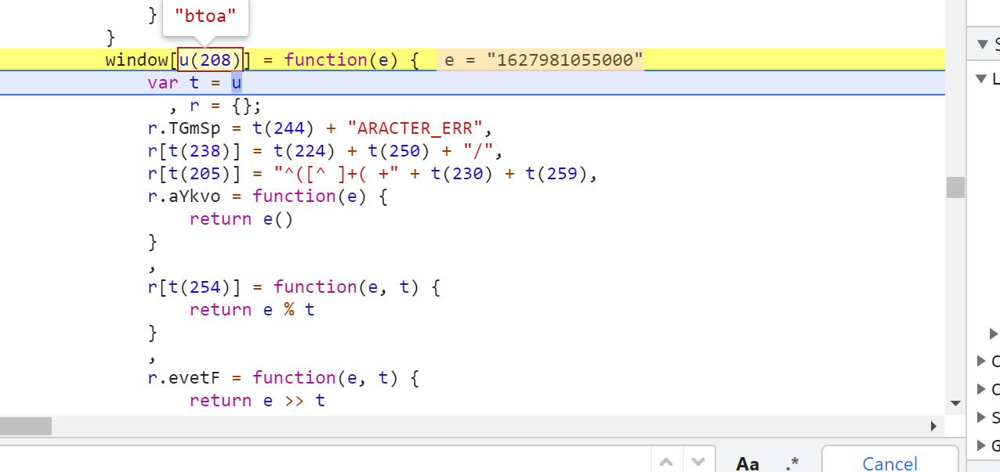

## 题目地址
```
https://match.yuanrenxue.com/match/16
```

## 调试过程
开一个XHR断点添加关键词`/api/match/16` 稍微往前追几个调用栈即可发现m生成的地方。  
  

m由时间戳调用btoa生成，但**此处的btoa被重写**，这大概就是为什么题目的名字叫window蜜罐。  



可以找到btoa函数定义的地方，使用的是旧版本的obfuscator混淆了，可以通过AST还原此处勉强可以看就直接硬钢了。


`bota`调用了`windows.md5`和`d`这两个函数本着缺啥补啥的原则都扣出来，然后就可以运行了但是不能通过验证。

需要进行回溯比较浏览器和node环境btoa的结果，最后发现是在try...catch的地方做了手脚。  

```
case 0:
    // delete window,
    //     delete document,
    // 老动我的window 和document 可恶
    c[t(246)](f[t(245)](i[t(212)](a, 2)));
    break;
case 1:

    // 找到有大佬是这样补充的可以通过验证 https://github.com/qiucl1001/YuanRenXue/blob/58c39f3ec1257a618a07bbc4a4ce48553e64fc91/question_16/js_anti_16.js
    // function n(r) {
    //     if (t[r])
    //         return t[r].exports;
    //     var i = t[r] = {
    //         exports: {}
    //     };
    //     return e[r].call(i.exports, i, i.exports, n),
    //         i.exports
    // }

    // n.g = function () {
    //     if ("object" == typeof globalThis)
    //         return globalThis;
    //     try {
    //         return this || new Function("return this")()
    //     } catch (e) {
    //         if ("object" == typeof window)
    //             return window
    //     }
    // }();

    // try {
    // 注意try catch的地方
    false || c[t(246)](f[t(245)](i.pHtmC(2 & o, 3) | i.evetF(a, 4)))
    // n.g 浏览器返回有值 为window
    // "WhHMm" === i[t(198)] || n.g && c[t(246)](f[t(245)](i.pHtmC(2 & o, 3) | i.evetF(a, 4)))
    // } catch (e) {
    //     c[t(246)](f[t(245)](i[t(229)](i.cVCcp(3 & o, 4), a >> 4)))
    // }
    break;
```

[最后的js代码](./16.js)