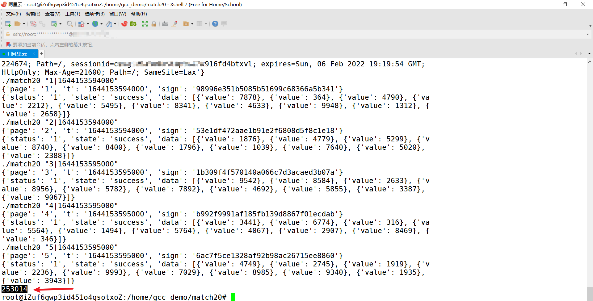

## 原文链接
https://www.52pojie.cn/thread-1581887-1-1.html

## 用到的工具总结
1. 将wasm转成c wasm2c https://github.com/WebAssembly/wabt  
   - 安装wasm2c需要编译 windows 平台需要 CMake和Visual Studio 编译之后就后包括wasm2c在内的一堆工具
2. 编译c代码的工具
   - windows 平台装了半天装不上mingw-w64 的gcc （放弃）
   - linux上装gcc 简单几行命令的事情（但ubuntu 上的gcc 编译的好像只能在Linux上用）

## 调试过程
导入函数环境检测处理，原文已经讲的挺详细了  
编写导出函数 `main.c` main函数中提供了两个参数来接受命令行参数。argc和argv，一个是命令行参数的长度，一个是命令行参数列表，完整代码如下
```
#include <stdio.h>
#include <stdlib.h>
#include "match20.c"

extern void init_wasm(void);
extern char* get_sign(char*);

void init_wasm(){
    init_func_types();
    init_globals();
    init_memory();
    init_table();
    init_exports();
}

char* get_sign(char* content){
    u32 retptr = w2c___wbindgen_add_to_stack_pointer(-16);
    int content_len = (int)strlen(content);
    u32 content_ptr = w2c___wbindgen_malloc( content_len + 1);
    memcpy(w2c_memory.data + content_ptr, content, content_len + 1);
    w2c_sign(retptr, content_ptr, content_len);
    int out_ptr = 0;
    out_ptr += (w2c_memory.data + retptr)[0];
    out_ptr += (w2c_memory.data + retptr)[1] << 8;
    out_ptr += (w2c_memory.data + retptr)[2] << 16;
    out_ptr += (w2c_memory.data + retptr)[3] << 24;

    char* out_str = (char *)malloc(33);
    out_str[32] = 0;
    memcpy(out_str, w2c_memory.data + out_ptr, 32);
    return out_str;
}

int main(int argc,char *argv[]) {
    init_wasm();
    char* content = argv[1];

    u32 retptr = w2c___wbindgen_add_to_stack_pointer(-16);
    int content_len = (int)strlen(content);
    u32 content_ptr = w2c___wbindgen_malloc( content_len + 1);
    memcpy(w2c_memory.data + content_ptr, content, content_len + 1);
    w2c_sign(retptr, content_ptr, content_len);
    int out_ptr = 0;
    out_ptr += (w2c_memory.data + retptr)[0];
    out_ptr += (w2c_memory.data + retptr)[1] << 8;
    out_ptr += (w2c_memory.data + retptr)[2] << 16;
    out_ptr += (w2c_memory.data + retptr)[3] << 24;

    char* out_str = (char *)malloc(33);
    out_str[32] = 0;
    memcpy(out_str, w2c_memory.data + out_ptr, 32);
    printf("%s\n", out_str);

    free(out_str);

    return 0;
}
```

编译  
```
gcc -o match20 main.c wasm-rt-impl.c
```
python 中以以下方式调用
```
nodejs = os.popen('./match20 "' + data['page'] + '|' + data['t'] + '"')
data['sign'] = nodejs.read().replace('\n', '')
nodejs.close()
```


## 总结
基本不会C语言看的晕晕的，但核心的原理就是编译成可执行文件供python调用

## 成功留念

