# 猿人学第5题
## 1.定位加密位置
找到有数据返回的请求发现有两个参数m和f并且cookie中有两个值 m 和 RM4hZBv0dDon443M 
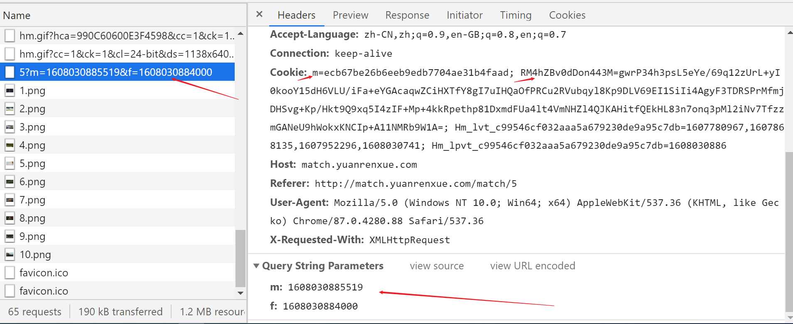  
经过测试cookie中的m和RM4hZBv0dDon443M是**必要的**并且**名称不会发生变化**  

此时可以通过搜索 RM4hZBv0dDon443M m m= m: 寻找入口，但是这题是搜不到的。

通过hook cookie中 RM4hZBv0dDon443M 的赋值寻找入口

随便找一个大部分js执行前下一个断点（此时cookie为空）  
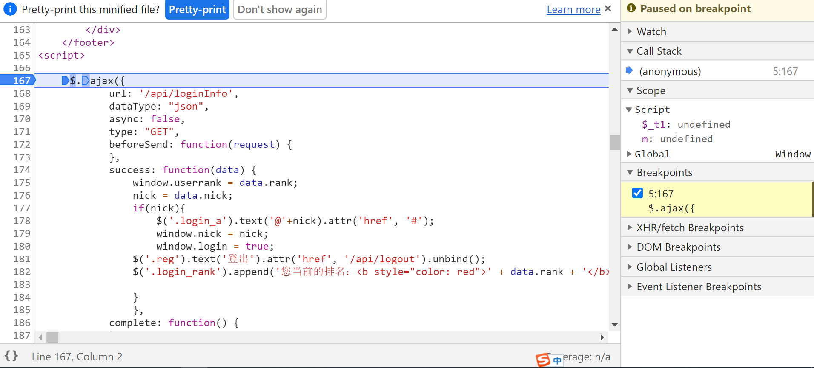

注入下面代码
```
var cookie_cache = document.cookie;
Object.defineProperty(document, 'cookie', {
    get: function() {
        console.log('Getting cookie');
        return cookie_cache;
    },
    set: function(val) {
        console.log('Setting cookie', val);
        // hook指定cookie键
        if(val.search('RM4hZBv0dDon443M') !=-1 ){
            debugger
        }
        var cookie = val.split(";")[0];
        var ncookie = cookie.split("=");
        var flag = false;
        var cache = cookie_cache.split("; ");
        cache = cache.map(function(a){
            if (a.split("=")[0] === ncookie[0]){
                flag = true;
                return cookie;
            }
            return a;
        })
        cookie_cache = cache.join("; ");
        if (!flag){
            cookie_cache += cookie + "; ";
        }
        this._value = val;
        return cookie_cache;
    },
});
```
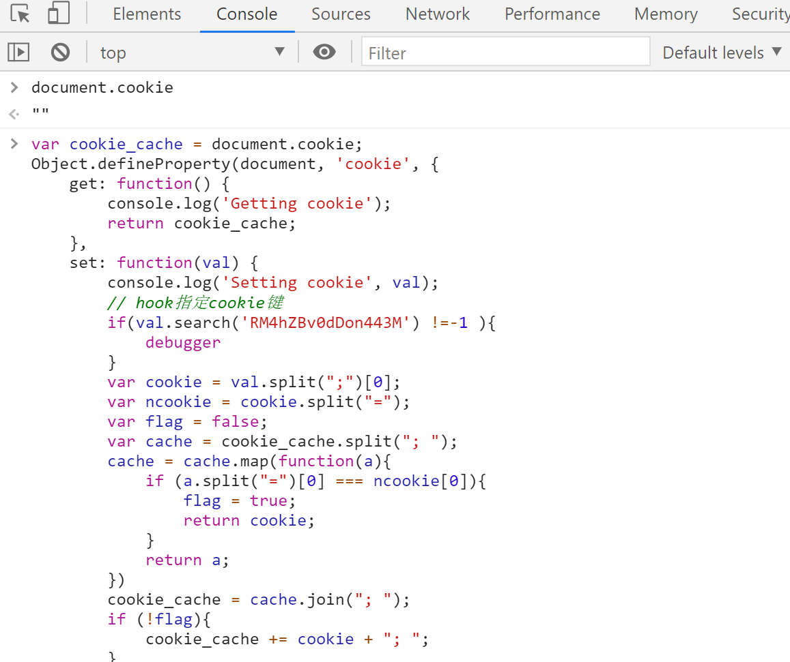

按F8进行调试在操作cookie并且其中有RM4hZBv0dDon443M时会进入断点，第三次进入断点时RM4hZBv0dDon443M有值
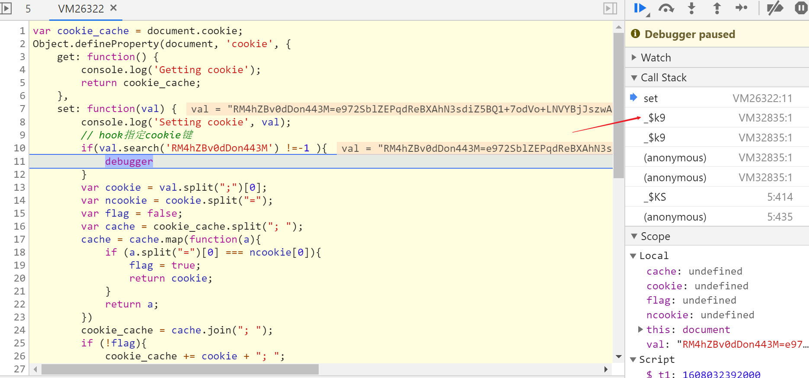

此时根据调用栈往下找成功找到RM4hZBv0dDon443M赋值的地方
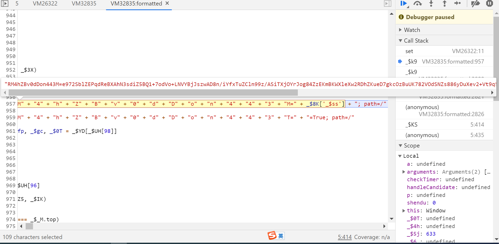

其中`_$8K`是window `_$ss`是window的一个属性，此时可以搜索`_$ss`没有结果，可以挨个分析`_$8K`但有66处结果比较多，此时再次使用hook技术hook window 的`_$ss`属性

hook的注入点，在RM4hZBv0dDon443M生成的vm文件前面随便下一个断点，或者使用之前那个hook注入点也行,注入一下代码。
```
Object.defineProperty(window, "_$ss", {
    set: function (e) {
        console.log('set _$ss', e)
        debugger
        return e;
    }
})
```

## 2.核心加密逻辑分析
成功hook到`_$ss`赋值的地方，同样的根据调用栈往下追可以看到`_$ss`赋值的地方  
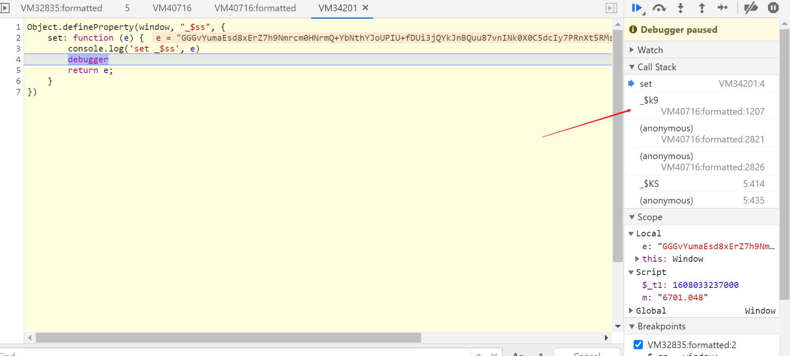


同时此时也是核心加密的位置  

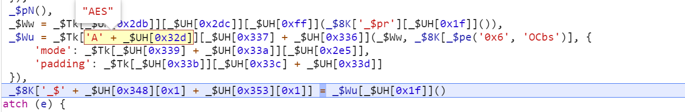

把鼠标放到对应位置可以看到这些字符串具体的值
还原后的代码
```
_$Ww = _$Tk["enc"]["Utf8"]["parse"](window['_$pr']["toString"]()), 
 _$Wu = _$Tk["AES"]["encrypt"](_$Ww, window["_$qF"], {
    'mode': _$Tk["mode"]["ECB"],
    'padding': _$Tk["pad"]["Pkcs7"]
}), 
window['_$ss'] = _$Wu["toString"]();
```

发现是AES加密ECB/Pkcs7，  
**加密的内容**是_$pr这个数组toString的结果    
**秘钥**是_$qF  
_$pr _$qF 都可以直接搜到

**密钥**_$qF 是请求中的参数m这个时间戳经过base64编码再取前十六位
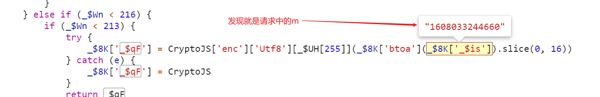  

**加密的内容**是_$pr这个数组push了5次  
push的内容是时间戳进过函数b处理后的结果  
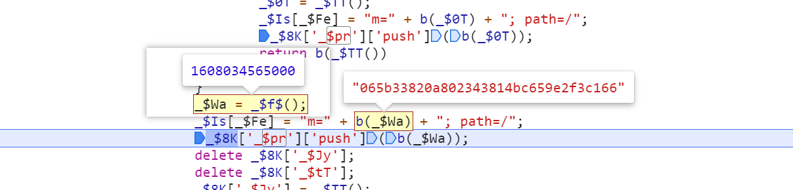  

所有逻辑就很清楚了 但是**还有一个巨坑**函数b的受到全局变量 `_$Jy` `_$tT` `_$6_`  的影响
hook一下函数b看看哈希前后的值。
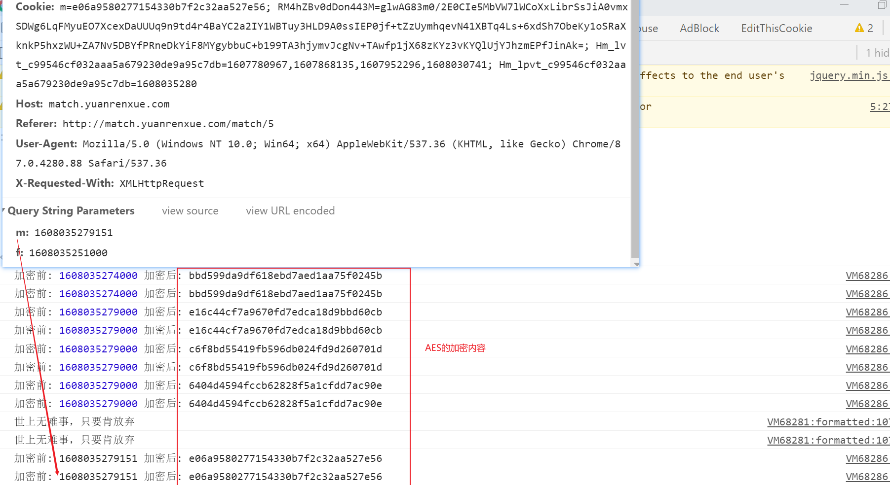  
并对比请求时的参数m和f，发现**m的哈希在加密的内容中**，f并没有出现在加密的内容中，**其他时间戳并没有发送给服务器**，因此猜测只要加密的内容中只要最后一位是m的b处理结果即可，f只要给个当前时间即可，函数b也只需要扣最后一次哈希m的即可。（之后测试猜测是准确的，当然也可以完全模拟，若要完全模拟b函数需要传入_$Jy _$tT _$6_作为参数）。

确定哈希m时函数b执行时 _$Jy _$tT _$6_的值，同样适用hook
```
(function hook_g() {
    var new_g = g;
    g = function (e) {
        var ret = new_g(e);
        // debugger
        console.log('_$Jy',_$Jy,'_$tT',_$tT,'_$6_',_$6_)
        console.log("加密前:", e, "加密后:", ret);
        return ret;
    }
})();
```
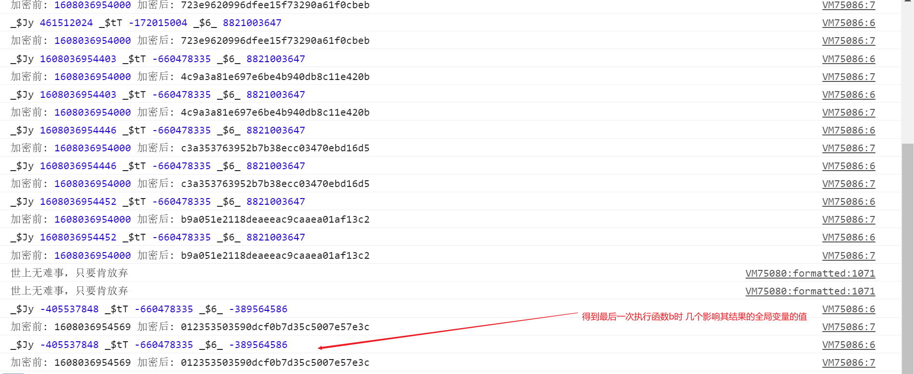 

[扣的js文件](../match05/05.js)


## 成功留念
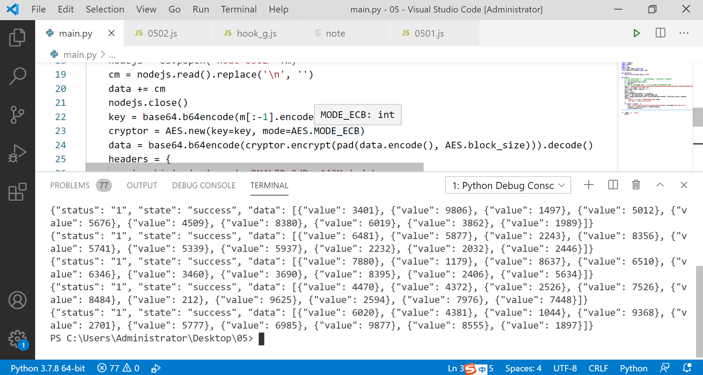