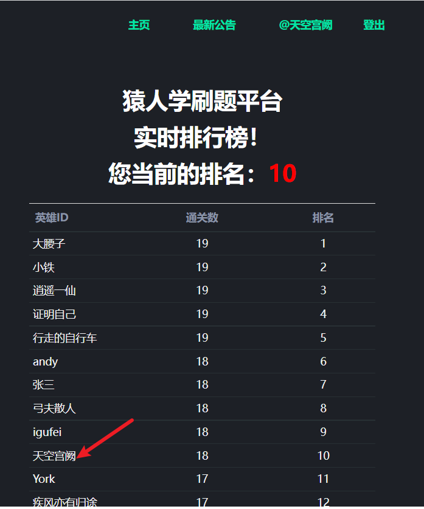

主流的反爬手段JS混淆、CSS反爬练习  

使用昵称`天空宫阙`目前通过`18题`排名`10`

> 2022.2.15
> 大佬不屑于做题让我也能排第十了 狗头

[第1题 详细思路](./note/match01.md)    
eval 加密后赋值给windows.f 从而外部调用， 通过replace替换变量为实参(时间戳)进行传参数

[第5题 详细思路](./note/match05.md)   
cookie反爬虫

[第9题 详细思路](./note/match09.md)   
动态cookie2  
AST 还原JavaScript混淆代码。  

[**第10题 详细思路**](./match10/readme.md)  
4代R数的低配静态版的壳 + jsjiami.com.v6 + obfuscator  

[第16题 思路](./match16/readme.md)
